# 3D Space Station
### Taariq Charles — COS3712 Computer Graphics

A real-time interactive 3D space station built entirely in Three.js — no 
external 3D models, no game engine. Every component is constructed from 
geometry primitives, every surface is lit and shaded in code, and every 
animation runs in a custom render loop.

This project was built in two phases as part of a university computer 
graphics course. Phase 1 covers geometry, animation, and camera systems. 
Phase 2 adds a full lighting model, three shading techniques, texture and 
normal mapping, environment mapping, and custom GLSL shaders.

> Assessment 2 codebase is tagged as `assessment-2-final` in the commit 
> history if you want to see the project before Phase 2 was added.

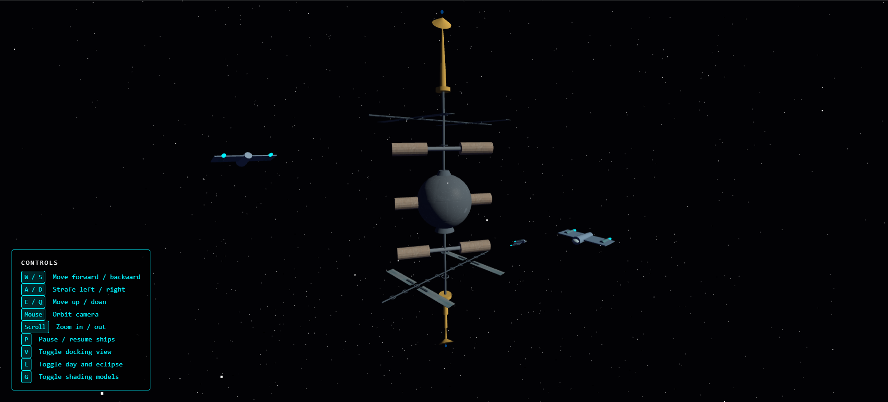

---

## Tech Stack

| | |
|---|---|
| Language | JavaScript (ES6+) |
| 3D Library | [Three.js](https://threejs.org/) r183 |
| Build Tool | [Vite](https://vitejs.dev/) |
| Shading Language | GLSL (via Three.js ShaderMaterial) |
| Version Control | Git & GitHub |

---

## Getting Started
```bash
git clone https://github.com/Taariq-06/space_station
cd space_station
npm install
npm run dev
```

Then open the link that appears in the terminal.

---

## Controls

| Input | Action |
|---|---|
| Mouse drag | Orbit camera |
| Scroll wheel | Zoom in / out |
| W / S | Move forward / backward |
| A / D | Strafe left / right |
| E / Q | Move up / down |
| P | Pause / resume all spacecraft |
| V | Toggle external orbit / docking view |
| L | Toggle day / eclipse lighting |
| G | Cycle shading models (Phong → Flat → Gouraud) |

---

## Features

### Lighting System

Three light types illuminate the scene:

**Directional Light — Sun**
Positioned at (200, 150, 100) to cast angled light across the station 
from the upper right. Press **L** to switch to eclipse mode — a dim blue 
directional light from the opposite direction simulates the station 
passing behind a planet.

| Day Mode | Eclipse Mode |
|---|---|
|  | 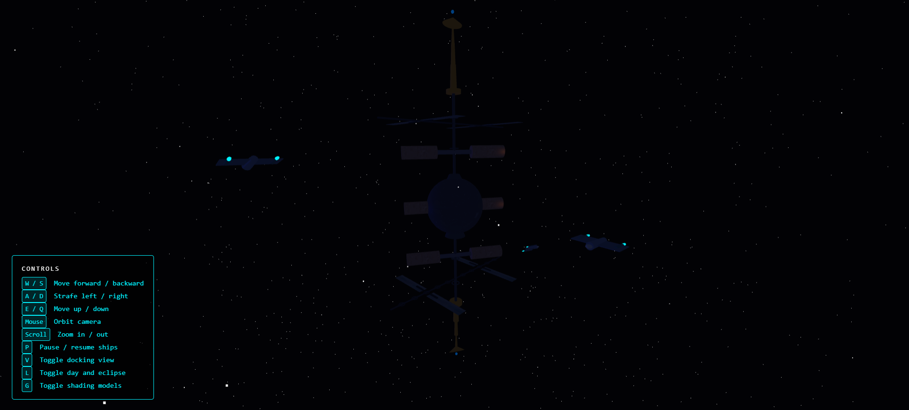 |

**Point Lights — Docking Bay Beacons**
Four point lights sit at the outer caps of the habitat modules. 
Orange-white, intensity 1.5, falloff radius 60 — simulating pressurised 
module lighting visible at each docking interface.

**Spotlights — Guidance and Searchlight**
A fixed spotlight aims at the upper port docking module. A second 
spotlight rotates around the station every frame — its target position 
is recalculated from `orbitClock` each tick, sweeping the searchlight 
across the structure continuously.

---

### Shading Models

All three classical shading models are implemented and live-switchable 
with **G**. The toggle traverses every mesh on the station and swaps 
materials at runtime, preserving texture maps across the swap.

**Flat** — one normal per face. Hard polygon edges, no interpolation.
**Gouraud** — lighting calculated per vertex, interpolated across faces.
**Phong** — lighting calculated per fragment. Smooth with specular highlights.

| Flat | Gouraud | Phong |
|---|---|---|
| 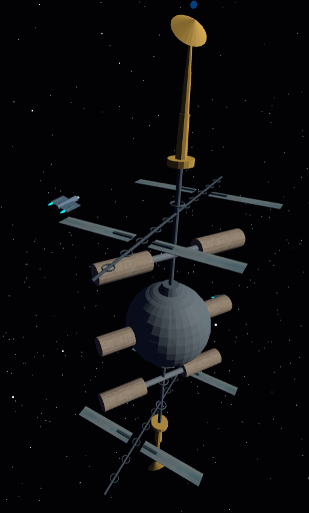 | 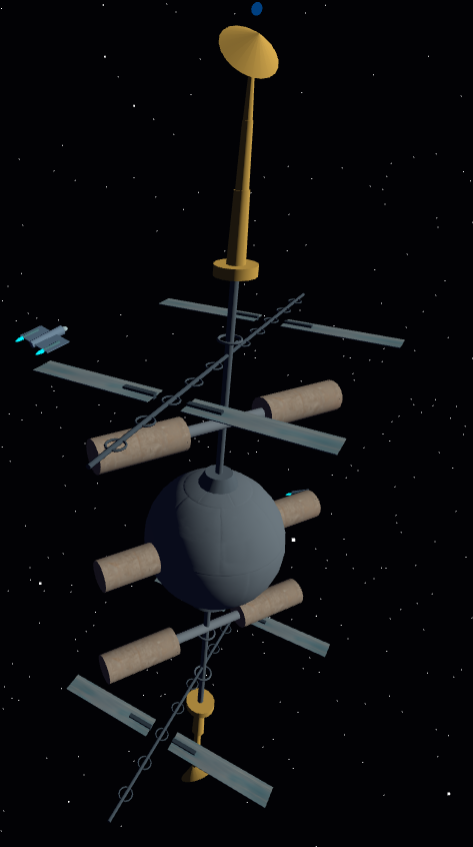 | 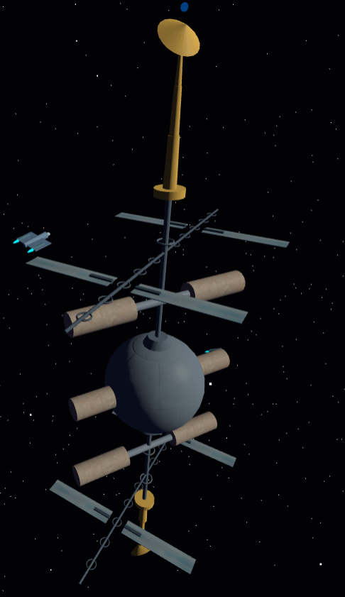 |

Implementation detail — Flat uses `MeshPhongMaterial` with 
`flatShading: true`, Gouraud uses `MeshLambertMaterial`, Phong uses 
`MeshPhongMaterial` with default settings. Ships always use Phong 
regardless of the toggle.

---

### Surface Mapping

Three mapping techniques are applied to the station:

**Diffuse Texture Mapping**
Metal plate texture on habitat module cylinders and end caps. Solar panel 
texture on photovoltaic surfaces. Both sourced from 
[Poly Haven](https://polyhaven.com) at 1K resolution.

**Normal Mapping**
A metal plate normal map is applied to the command sphere. The normal map 
encodes surface direction per pixel — the geometry remains a smooth sphere 
but the lighting model reads the normal map and renders it as if physical 
panel seams and hull detail exist on the surface.

**Environment Mapping**
A `WebGLCubeRenderTarget` and `CubeCamera` are positioned at the sphere 
centre. Every frame the cube camera captures the live scene in all six 
directions and feeds it back into the sphere material as `envMap`. The 
reflection shifts as you orbit — it is capturing the actual scene, not a 
static image.

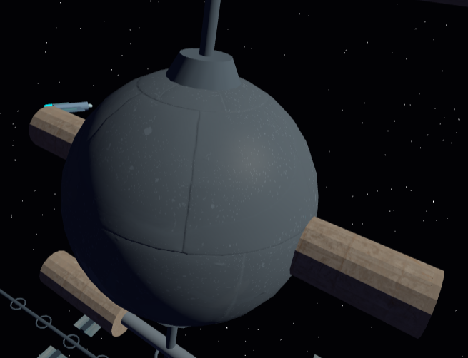

---

### GLSL Shader

A custom `ShaderMaterial` is applied to the beacon tips on both 
communication towers. Defined in `src/shaders/BeaconShader.js`.

The fragment shader uses `sin(uTime)` to oscillate a `pulse` value 
between 0 and 1. `mix()` interpolates between deep blue and bright cyan 
based on the pulse — producing a breathing glow effect. The `uTime` 
uniform is updated every frame from `orbitClock` in the animation loop.

| Cyan peak | Blue trough |
|---|---|
| 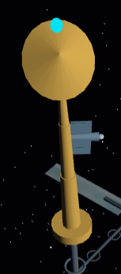 | 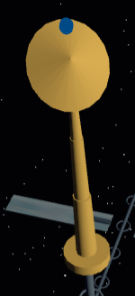 |
```glsl
float pulse = sin(uTime * 3.0) * 0.5 + 0.5;
vec3 color = mix(deepBlue, brightCyan, pulse);
gl_FragColor = vec4(color, 1.0);
```

---

## Project Structure
```
src/
├── components/
│   ├── starfield.js      — two-layer static star field
│   ├── station.js        — full station geometry, materials, shading toggle
│   ├── fleet.js          — 4 spacecraft with orbital animation
│   └── lighting.js       — all three light types, day/eclipse toggle
├── core/
│   ├── sceneManager.js   — scene, renderer, animation loop, event handling
│   └── cameraControls.js — OrbitControls, WASD, view switching
├── shaders/
│   └── beaconShader.js   — GLSL vertex + fragment shader for beacon pulse
└── main.js               — entry point
public/
└── textures/
    ├── metal_plate_diff_1k.jpg
    ├── metal_plate_nor_gl_1k.jpg
    ├── solar_panels_diff_1k.jpg
    └── starfield_1k.hdr
screenshots/              — all project screenshots for README
```

---

## Station Architecture

The station is built entirely from Three.js geometry primitives, 
structured around a central vertical spine.

### Command Sphere
The pressurised command module at the midpoint of the spine. 
`SphereGeometry` with Phong shading, normal mapping, and live 
environment reflection. Two tapered junction collars above and below 
suggest it is physically bolted onto the truss.

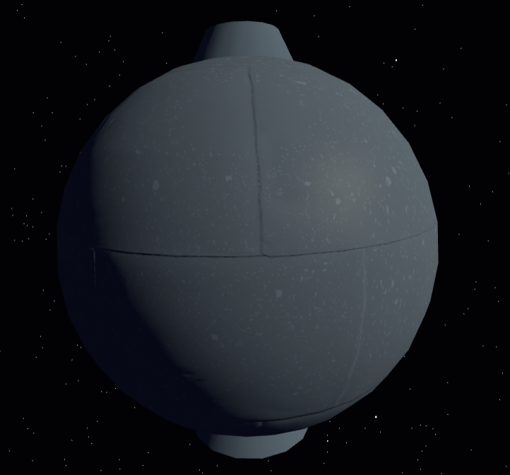

### Central Spine
A vertical `CylinderGeometry` running the full height of the station. 
Seven torus collar rings spaced evenly along its length suggest segmented 
truss construction — inspired by the Integrated Truss Structure of the ISS.

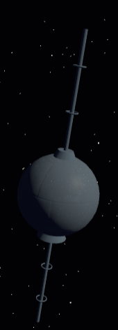

### Habitat & Docking Modules ×6
Six pressurised modules extend horizontally from the spine — three port, 
three starboard, staggered at Y = 30, 0, −30. Each module has a 
connecting tunnel, a habitat cylinder with metal plate texture, and two 
end caps.

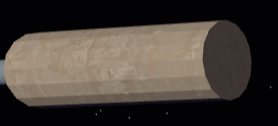

### Solar Array Arms ×4
Four arms at Y = ±45, alternating port and starboard. Each has a boom, 
five cross-brace rings, two photovoltaic panels with solar texture, and 
mounting brackets. The solar group rotates independently of the station 
to imply sun-tracking — a hierarchical transform on top of the station 
rotation.

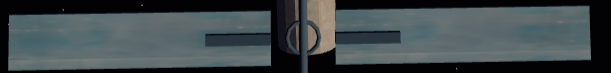

### Communication Towers ×2
Top and bottom of the spine at Y = ±60. Three-segment telescoping mast, 
tilted parabolic dish, and a beacon tip running the custom GLSL pulse 
shader. Both towers are built from a single `buildTower` function using a 
direction multiplier to mirror the bottom tower automatically.

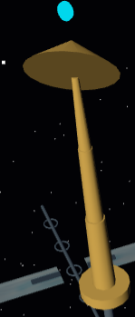

### Spacecraft Fleet ×4
Four ships orbit on independent paths defined by radius, inclination, and 
speed. Each ship has a fuselage, flattened nose, delta wings, engine pods, 
and cyan engine glow. Hull surfaces use Phong shading. Engine glow uses 
`MeshBasicMaterial` so it emits regardless of scene lighting.

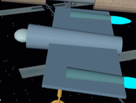

---

## Known Limitations

**No planetary orbit** — implementing a convincing planet with orbital 
mechanics would have detracted from the station detail, which is the 
primary deliverable. Noted as a missing feature.

**First-person docking view** — the V key positions the camera just 
outside a docking port looking inward. A truly immersive interior view 
would require disabling OrbitControls and implementing a dedicated 
first-person controller.

**Scale** — all dimensions are chosen for visual readability in the 
browser, not real-world accuracy.

---

## 📚 References & Documentation

### Three.js — Core
- [Scene](https://threejs.org/docs/#api/en/scenes/Scene)
- [Color](https://threejs.org/docs/#api/en/math/Color)
- [PerspectiveCamera](https://threejs.org/docs/#api/en/cameras/PerspectiveCamera)
- [PerspectiveCamera.updateProjectionMatrix](https://threejs.org/docs/#api/en/cameras/PerspectiveCamera.updateProjectionMatrix)
- [WebGLRenderer](https://threejs.org/docs/#api/en/renderers/WebGLRenderer)
- [WebGLRenderer.render](https://threejs.org/docs/#api/en/renderers/WebGLRenderer.render)
- [WebGLRenderer.setSize](https://threejs.org/docs/#api/en/renderers/WebGLRenderer.setSize)
- [Object3D.traverse](https://threejs.org/docs/#api/en/core/Object3D.traverse)
- [Object3D.visible](https://threejs.org/docs/#api/en/core/Object3D.visible)
- [Object3D.scale](https://threejs.org/docs/#api/en/core/Object3D.scale)
- [Object3D.updateMatrixWorld](https://threejs.org/docs/#api/en/core/Object3D.updateMatrixWorld)
- [Vector3.copy](https://threejs.org/docs/#api/en/math/Vector3.copy)

### Three.js — Objects & Groups
- [Group](https://threejs.org/docs/#api/en/objects/Group)
- [Mesh](https://threejs.org/docs/#api/en/objects/Mesh)
- [Points](https://threejs.org/docs/#api/en/objects/Points)

### Three.js — Geometry
- [BufferGeometry](https://threejs.org/docs/#api/en/core/BufferGeometry)
- [BufferAttribute (Float32BufferAttribute)](https://threejs.org/docs/#api/en/core/BufferAttribute)
- [BoxGeometry](https://threejs.org/docs/#api/en/geometries/BoxGeometry)
- [ConeGeometry](https://threejs.org/docs/#api/en/geometries/ConeGeometry)
- [CylinderGeometry](https://threejs.org/docs/#api/en/geometries/CylinderGeometry)
- [SphereGeometry](https://threejs.org/docs/#api/en/geometries/SphereGeometry)
- [TorusGeometry](https://threejs.org/docs/#api/en/geometries/TorusGeometry)

### Three.js — Materials
- [MeshBasicMaterial](https://threejs.org/docs/#api/en/materials/MeshBasicMaterial)
- [PointsMaterial](https://threejs.org/docs/#api/en/materials/PointsMaterial)
- [MeshPhongMaterial](https://threejs.org/docs/#api/en/materials/MeshPhongMaterial)
- [MeshLambertMaterial](https://threejs.org/docs/#api/en/materials/MeshLambertMaterial)
- [ShaderMaterial](https://threejs.org/docs/#api/en/materials/ShaderMaterial)
- [ShaderMaterial.uniforms](https://threejs.org/docs/#api/en/materials/ShaderMaterial.uniforms)
- [ShaderMaterial.vertexShader](https://threejs.org/docs/#api/en/materials/ShaderMaterial.vertexShader)
- [ShaderMaterial.fragmentShader](https://threejs.org/docs/#api/en/materials/ShaderMaterial.fragmentShader)
- [MeshPhongMaterial.shininess](https://threejs.org/docs/#api/en/materials/MeshPhongMaterial.shininess)
- [MeshPhongMaterial.normalMap](https://threejs.org/docs/#api/en/materials/MeshPhongMaterial.normalMap)
- [MeshPhongMaterial.envMap](https://threejs.org/docs/#api/en/materials/MeshPhongMaterial.envMap)
- [MeshPhongMaterial.reflectivity](https://threejs.org/docs/#api/en/materials/MeshPhongMaterial.reflectivity)
- [Material.flatShading](https://threejs.org/docs/#api/en/materials/Material.flatShading)
- [Material.map](https://threejs.org/docs/#api/en/materials/Material)
- [Color.getHex](https://threejs.org/docs/#api/en/math/Color.getHex)

### Three.js — Math & Vectors
- [Vector3](https://threejs.org/docs/#api/en/math/Vector3)
- [Vector3.set](https://threejs.org/docs/#api/en/math/Vector3.set)
- [Vector3.crossVectors](https://threejs.org/docs/#api/en/math/Vector3.crossVectors)
- [Vector3.normalize](https://threejs.org/docs/#api/en/math/Vector3.normalize)
- [Vector3.addScaledVector](https://threejs.org/docs/#api/en/math/Vector3.addScaledVector)

### Three.js — Object3D (shared by all objects)
- [Object3D.add](https://threejs.org/docs/#api/en/core/Object3D.add)
- [Object3D.position](https://threejs.org/docs/#api/en/core/Object3D.position)
- [Object3D.rotation](https://threejs.org/docs/#api/en/core/Object3D.rotation)
- [Object3D.lookAt](https://threejs.org/docs/#api/en/core/Object3D.lookAt)
- [Object3D.getWorldDirection](https://threejs.org/docs/#api/en/core/Object3D.getWorldDirection)

### Three.js — Controls
- [OrbitControls](https://threejs.org/docs/#examples/en/controls/OrbitControls)
- [OrbitControls.enableDamping](https://threejs.org/docs/#examples/en/controls/OrbitControls.enableDamping)
- [OrbitControls.dampingFactor](https://threejs.org/docs/#examples/en/controls/OrbitControls.dampingFactor)
- [OrbitControls.maxDistance](https://threejs.org/docs/#examples/en/controls/OrbitControls.maxDistance)
- [OrbitControls.target](https://threejs.org/docs/#examples/en/controls/OrbitControls.target)
- [OrbitControls.update](https://threejs.org/docs/#examples/en/controls/OrbitControls.update)
- [OrbitControls.enabled](https://threejs.org/docs/#examples/en/controls/OrbitControls.enabled)

### Three.js — Lights
- [DirectionalLight](https://threejs.org/docs/#api/en/lights/DirectionalLight)
- [AmbientLight](https://threejs.org/docs/#api/en/lights/AmbientLight)
- [PointLight](https://threejs.org/docs/#api/en/lights/PointLight)
- [SpotLight](https://threejs.org/docs/#api/en/lights/SpotLight)
- [SpotLight.angle](https://threejs.org/docs/#api/en/lights/SpotLight.angle)
- [SpotLight.penumbra](https://threejs.org/docs/#api/en/lights/SpotLight.penumbra)
- [SpotLight.distance](https://threejs.org/docs/#api/en/lights/SpotLight.distance)
- [SpotLight.target](https://threejs.org/docs/#api/en/lights/SpotLight.target)

### Textures & Loaders
- [TextureLoader](https://threejs.org/docs/#api/en/loaders/TextureLoader)
- [TextureLoader.load](https://threejs.org/docs/#api/en/loaders/TextureLoader.load)

### Three.js - Environmnent Mapping
- [WebGLCubeRenderTarget](https://threejs.org/docs/#api/en/renderers/WebGLCubeRenderTarget)
- [CubeCamera](https://threejs.org/docs/#api/en/cameras/CubeCamera)
- [CubeCamera.update](https://threejs.org/docs/#api/en/cameras/CubeCamera.update)
- [WebGLRenderTarget.texture](https://threejs.org/docs/#api/en/renderers/WebGLRenderTarget.texture)

### Three.js — Shaders
- [UniformsUtils](https://threejs.org/docs/#api/en/renderers/shaders/UniformsUtils)
- [WebGLProgram](https://threejs.org/docs/#api/en/renderers/webgl/WebGLProgram)


### GLSL — Khronos Reference
- [GLSL sin()](https://registry.khronos.org/OpenGL-Refpages/gl4/html/sin.xhtml)
- [GLSL mix()](https://registry.khronos.org/OpenGL-Refpages/gl4/html/mix.xhtml)
- [GLSL gl_Position](https://registry.khronos.org/OpenGL-Refpages/gl4/html/gl_Position.xhtml)
- [GLSL gl_FragColor](https://registry.khronos.org/OpenGL-Refpages/gl4/html/gl_FragColor.xhtml)
- [GLSL Data Types](https://www.khronos.org/opengl/wiki/Data_Type_(GLSL))
- [GLSL Type Qualifiers](https://www.khronos.org/opengl/wiki/Type_Qualifier_(GLSL))

### Web APIs
- [document.querySelector](https://developer.mozilla.org/en-US/docs/Web/API/Document/querySelector)
- [window.innerWidth / innerHeight](https://developer.mozilla.org/en-US/docs/Web/API/Window/innerWidth)
- [window.addEventListener](https://developer.mozilla.org/en-US/docs/Web/API/EventTarget/addEventListener)
- [requestAnimationFrame](https://developer.mozilla.org/en-US/docs/Web/API/Window/requestAnimationFrame)

### JavaScript
- [Math.random](https://developer.mozilla.org/en-US/docs/Web/JavaScript/Reference/Global_Objects/Math/random)
- [Math.cos](https://developer.mozilla.org/en-US/docs/Web/JavaScript/Reference/Global_Objects/Math/cos)
- [Math.sin](https://developer.mozilla.org/en-US/docs/Web/JavaScript/Reference/Global_Objects/Math/sin)
- [Math.PI](https://developer.mozilla.org/en-US/docs/Web/JavaScript/Reference/Global_Objects/Math/PI)
- [Array.prototype.forEach](https://developer.mozilla.org/en-US/docs/Web/JavaScript/Reference/Global_Objects/Array/forEach)
- [Array.prototype.push](https://developer.mozilla.org/en-US/docs/Web/JavaScript/Reference/Global_Objects/Array/push)
- [String.prototype.toLowerCase](https://developer.mozilla.org/en-US/docs/Web/JavaScript/Reference/Global_Objects/String/toLowerCase)
- [Array.prototype.map()](https://developer.mozilla.org/en-US/docs/Web/JavaScript/Reference/Global_Objects/Array/map)
- [Array.prototype.forEach()](https://developer.mozilla.org/en-US/docs/Web/JavaScript/Reference/Global_Objects/Array/forEach)
- [Array.prototype.push()](https://developer.mozilla.org/en-US/docs/Web/JavaScript/Reference/Global_Objects/Array/push)
- [Math.PI](https://developer.mozilla.org/en-US/docs/Web/JavaScript/Reference/Global_Objects/Math/PI)
- [Math.cos()](https://developer.mozilla.org/en-US/docs/Web/JavaScript/Reference/Global_Objects/Math/cos)
- [Math.sin()](https://developer.mozilla.org/en-US/docs/Web/JavaScript/Reference/Global_Objects/Math/sin)
- [Destructuring assignment](https://developer.mozilla.org/en-US/docs/Web/JavaScript/Reference/Operators/Destructuring_assignment)
- [Template literals](https://developer.mozilla.org/en-US/docs/Web/JavaScript/Reference/Template_literals)
- [Remainder operator (%)](https://developer.mozilla.org/en-US/docs/Web/JavaScript/Reference/Operators/Remainder)
- [switch statement](https://developer.mozilla.org/en-US/docs/Web/JavaScript/Reference/Statements/switch)
- [export](https://developer.mozilla.org/en-US/docs/Web/JavaScript/Reference/Statements/export)
- [console.log()](https://developer.mozilla.org/en-US/docs/Web/API/console/log_static)

### External Resources
- [Three.js Fundamentals](https://threejs.org/manual/#en/fundamentals)
- [Three.js Primitives Guide](https://threejs.org/manual/#en/primitives)
- [Three.js Cameras Guide](https://threejs.org/manual/#en/cameras)
- [How to organise a Three.js project](https://pierfrancesco-soffritti.medium.com/how-to-organize-the-structure-of-a-three-js-project-77649f58fa3f)
- [Three.js project structure discussion](https://discourse.threejs.org/t/how-to-organise-a-project-in-a-better-way/2051)
- [threejs-app structure reference](https://github.com/mattdesl/threejs-app/tree/master/src)
- [NASA — ISS Assembly Elements](https://www.nasa.gov/international-space-station/international-space-station-assembly-elements/)
- [Three.js 101 Crash Course: Beginner’s Guide to 3D Web Design (7 HOURS!)](https://youtu.be/KM64t3pA4fs?si=OepnL-_TJn3HKpq5)
- [Poly Haven — Textures](https://polyhaven.com)
