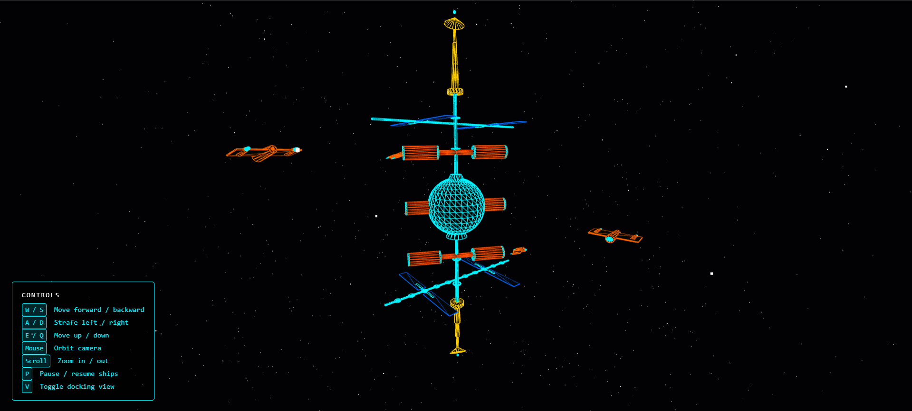
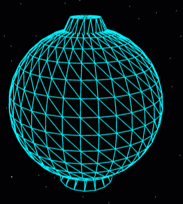
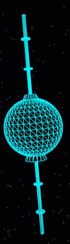
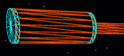
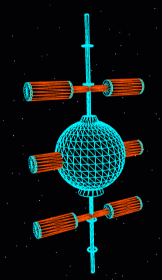
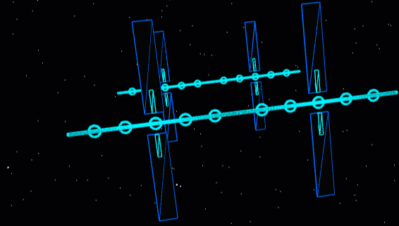
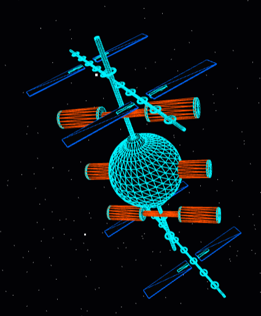
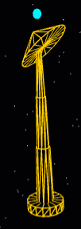
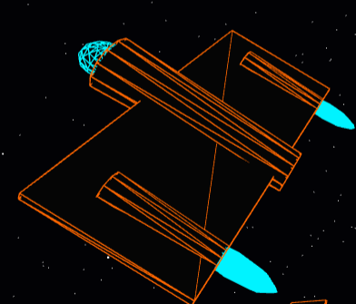
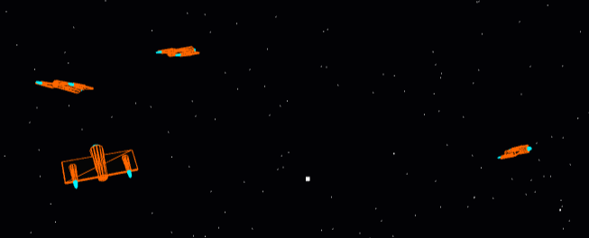

# 3D Space Station 
### Taariq Charles

## Overview

A real-time, interactive 3D space station built with HTML, CSS, and JavaScript, 
using the Three.js library for 3D rendering. Inspired by the ISS (International 
Space Station), users can freely explore a simulated space station from any angle 
— orbiting, zooming, and navigating through the scene in real time.

https://github.com/user-attachments/assets/7d6d2d82-ab1a-460e-9bef-c7e34ef26221

## 🚀 Tech Stack
* **Language:** JavaScript (ES6+)
* **3D Library:** [Three.js](https://threejs.org/)
* **Build Tool:** [Vite](https://vitejs.dev/)
* **Version Control:** Git & GitHub

## How to Run

1. Clone the repository to your local machine
2. Open the project in your code editor
3. In the terminal, run `npm i` to install dependencies
4. Run `npm run dev` to start the local development server
5. Hold `Ctrl` and click the link that appears in the terminal to open the app in your browser

## Controls

| Input | Action |
|---|---|
| Mouse drag | Orbit camera around the station |
| Scroll wheel | Zoom in and out |
| W / S | Move camera forward and backward |
| A / D | Strafe camera left and right |
| E / Q | Move camera up and down |
| P | Pause and resume all spacecraft |
| V | Toggle between external orbit view and first-person docking view |

## 🛠️ Assessment Criteria Checklist

### Objectives

- [x] **Build a 3D space station using primitives**
  All station components are built entirely from Three.js geometry primitives 
  (CylinderGeometry, SphereGeometry, BoxGeometry, TorusGeometry, ConeGeometry). 
  No external 3D models were imported. Components 1–7 in main.js cover every 
  structural element of the station.

- [x] **Animate spacecraft and rotating components**
  Demonstrated in the animation loop using a `shipOrbits` array that pre-defines 
  each ship's radius, inclination, and speed. A `forEach` loop applies these 
  parameters to each spacecraft every frame. The station rotates slowly on 
  multiple axes, and the solar arrays rotate independently on top of the station 
  rotation — demonstrating hierarchical animation.

- [x] **Implement full camera navigation**
  Implemented using the OrbitControls add-on from Three.js for mouse orbit and 
  scroll zoom. WASD and Q/E key tracking was added manually in the animation loop 
  for full free-roam movement in all six directions.

- [x] **Use perspective projection**
  Implemented using Three.js `PerspectiveCamera` with a 75° field of view, 
  mimicking the way the human eye perceives depth and distance. Declared and 
  configured before any scene components are built.

### Implementation Requirements

#### 1. Space Station Structure

- [x] **Central core using cylinders or spheres**
  A `SphereGeometry` forms the command sphere at the midpoint of the spine. 
  Two tapered `CylinderGeometry` junction collars sit above and below it, 
  suggesting the sphere is physically bolted onto the truss backbone.

- [x] **Minimum 6 docking modules**
  Six pressurised habitat modules extend horizontally from the spine — three on 
  the port side (+X) and three on the starboard side (-X), staggered at Y = 30, 
  0, and -30. Each module has a connecting tunnel, a main habitat cylinder, and 
  two end caps.

- [x] **Minimum 4 solar panel arrays**
  Four solar array arms are mounted on the spine at Y = ±45, alternating port 
  and starboard. Each arm has a structural boom, five cross-brace rings, two 
  photovoltaic panels, and mounting brackets. The solar group rotates 
  independently to imply sun-tracking.

- [x] **Minimum 2 communication towers**
  Two towers are mounted at the top and bottom of the spine (Y = ±60). Each has 
  a base mounting plate, a three-segment telescoping mast, a tilted parabolic 
  dish, and a cyan beacon tip. Both towers are built from a single `buildTower` 
  function using a direction multiplier to mirror the bottom tower automatically.

- [x] **Station must rotate slowly in space**
  The `spaceStation` group rotates on Y, X, and Z axes every frame inside the 
  animation loop. The Y rotation is the most visible. X and Z add a subtle 
  natural drift.

- [x] **Must demonstrate scaling, rotation, and translation**
  - **Scaling** — wireframe meshes are uniformly scaled to 1.01–1.02 to prevent 
    Z-fighting. Wings use non-uniform scaling (thin on Y). Nose sphere is 
    flattened with `scale.y = 0.6`.
  - **Rotation** — cylinders are rotated 90° to point horizontally. Torus rings 
    are rotated to wrap around the spine. Dishes are tilted 45°.
  - **Translation** — every component is positioned using `.position.x/y/z` 
    relative to its parent group, building up the full station through 
    hierarchical offsets.

---

#### 2. Spacecraft & Animation

- [x] **Minimum 4 spacecraft following defined orbital paths**
  Four ships orbit the station, each with unique parameters defined in the 
  `shipOrbits` array — different radius, inclination angle, and speed. 
  Inclination lifts each orbit out of the flat equatorial plane using 3D 
  trigonometry, creating a realistic multi-orbit environment.

- [x] **Smooth continuous movement using translation and rotation**
  Ship position is calculated every frame using `Math.cos` and `Math.sin` for 
  smooth circular motion. The look-behind method using `lookAt()` ensures the 
  nose always faces the correct flight direction at every point in the orbit.

- [x] **Controls to pause/resume all ships simultaneously**
  The `P` key toggles the `isOrbiting` flag. When false, `currentOrbitTime` 
  stops incrementing, which freezes all ship positions simultaneously. Pressing 
  P again resumes all ships from exactly where they stopped.

---

#### 3. Camera & User Controls

- [x] **Free camera movement (forward/backward, left/right, up/down)**
  W/S moves the camera along its own forward vector. A/D strafes along the right 
  vector, calculated using `crossVectors`. E/Q moves up and down on the world Y 
  axis. All movement is relative to the camera's current orientation.

- [x] **Zoom in/out**
  Scroll wheel zoom is handled by OrbitControls. Minimum distance is 10 units 
  (cannot clip inside the station) and maximum distance is 500 units.

- [x] **Switch between external orbit view and first-person docking view**
  The `V` key toggles between two camera positions. External view pulls back to 
  Y=30, Z=150 for a full station overview. First-person docking view positions 
  the camera at X=55, Y=30 outside the upper port habitat module, looking inward 
  toward the station core to simulate an approach-to-dock perspective.

- [x] **Camera movement must be smooth**
  OrbitControls damping is enabled with a factor of 0.03, giving the camera a 
  cinematic glide after mouse release. WASD movement uses per-frame increments 
  at a consistent speed of 0.8 units per frame.

---

## 🏗️ Station Components

The station is built entirely from Three.js geometry primitives, structured 
around a central vertical spine — inspired by the engineering logic of the 
real ISS.

**Command Sphere**
The central core of the station. A sphere sits at the midpoint of the spine, 
representing the pressurised command module. Two tapered junction collars above 
and below it suggest it is physically bolted onto the truss backbone.

**Central Spine**
The structural backbone of the entire station. A vertical truss cylinder runs 
the full height of the station along the Y-axis. Every major component attaches 
to it. Seven evenly spaced collar rings along its length suggest segmented truss 
construction, inspired by the Integrated Truss Structure (ITS) of the ISS.

**Habitat & Docking Modules (×6)**
Six pressurised habitat modules extend horizontally from the spine — three on 
the port side and three on the starboard side, staggered at three heights. 
Each module consists of:
- A connecting tunnel from the spine to the module
- A main habitat cylinder (the pressurised volume)
- Two end caps (flat discs) — the docking interfaces

**Solar Array Arms (×4)**
Four solar array arms are mounted at the upper and lower portions of the spine, 
two on each side (port and starboard), alternating like the ISS arrays. 
Each arm consists of:
- A horizontal boom extending from the spine
- Cross-brace rings along the boom — suggesting truss construction
- Two photovoltaic panels (fore and aft of the boom)
- Mounting brackets connecting the panels to the boom

**Communication Towers (×2)**
Two communication towers sit at the very top and bottom ends of the spine. 
Each tower consists of:
- A base mounting plate
- A three-segment telescoping mast of decreasing radius
- A parabolic dish tilted at 45° — scanning position
- A cyan beacon tip at the very top

Both towers are built from a single `buildTower` function, using a direction 
multiplier to automatically mirror the bottom tower from the top.

**Spacecraft Fleet (×4)**
Four spacecraft orbit the station on independent paths, each with a unique 
radius, inclination angle, and speed. Each ship is built from a fuselage, 
a flattened nose, delta wings, two engine pods, and twin engine glow exhausts.

## ⚠️ Known Limitations

**No planetary orbit**
The assessment brief states the station should orbit a planet. After nearly 
1000 lines of code building the station itself, implementing a planet with a 
convincing orbital path would have detracted from the detail and quality of 
the station — which is the primary deliverable of Assessment 2. The planet 
and orbital mechanics are noted as a missing feature.

**The space station is a hypothetical model**
The station is inspired by the ISS but does not accurately replicate it. 
Building a completely realistic space station is outside the scope of this 
project. The design prioritises engineering logic and visual clarity over 
exact technical accuracy.

**First-person docking view**
The first-person view does not fully resemble being inside a space station. 
It is better described as a close external perspective from just outside a 
docking port, looking inward toward the station core. A truly immersive 
first-person view — locked inside the station looking outward — would require 
disabling OrbitControls entirely and implementing a dedicated first-person 
camera controller, which is beyond the scope of this assessment.

**Scale**
The station components are small relative to what a real space station would 
look like at true scale. All dimensions were chosen to make the station visually 
readable and navigable in the browser, not to reflect real-world measurements.

**No lighting or textures**
The station uses only MeshBasicMaterial with wireframe overlays — no lighting, 
shading, or texture mapping has been applied. This is intentional. These features 
are reserved for future improvements

## 📚 References & Documentation

### Three.js — Core
- [Scene](https://threejs.org/docs/#api/en/scenes/Scene)
- [Color](https://threejs.org/docs/#api/en/math/Color)
- [PerspectiveCamera](https://threejs.org/docs/#api/en/cameras/PerspectiveCamera)
- [PerspectiveCamera.updateProjectionMatrix](https://threejs.org/docs/#api/en/cameras/PerspectiveCamera.updateProjectionMatrix)
- [WebGLRenderer](https://threejs.org/docs/#api/en/renderers/WebGLRenderer)
- [WebGLRenderer.render](https://threejs.org/docs/#api/en/renderers/WebGLRenderer.render)
- [WebGLRenderer.setSize](https://threejs.org/docs/#api/en/renderers/WebGLRenderer.setSize)

### Three.js — Objects & Groups
- [Group](https://threejs.org/docs/#api/en/objects/Group)
- [Mesh](https://threejs.org/docs/#api/en/objects/Mesh)
- [Points](https://threejs.org/docs/#api/en/objects/Points)

### Three.js — Geometry
- [BufferGeometry](https://threejs.org/docs/#api/en/core/BufferGeometry)
- [BufferAttribute (Float32BufferAttribute)](https://threejs.org/docs/#api/en/core/BufferAttribute)
- [BoxGeometry](https://threejs.org/docs/#api/en/geometries/BoxGeometry)
- [ConeGeometry](https://threejs.org/docs/#api/en/geometries/ConeGeometry)
- [CylinderGeometry](https://threejs.org/docs/#api/en/geometries/CylinderGeometry)
- [SphereGeometry](https://threejs.org/docs/#api/en/geometries/SphereGeometry)
- [TorusGeometry](https://threejs.org/docs/#api/en/geometries/TorusGeometry)

### Three.js — Materials
- [MeshBasicMaterial](https://threejs.org/docs/#api/en/materials/MeshBasicMaterial)
- [PointsMaterial](https://threejs.org/docs/#api/en/materials/PointsMaterial)

### Three.js — Math & Vectors
- [Vector3](https://threejs.org/docs/#api/en/math/Vector3)
- [Vector3.set](https://threejs.org/docs/#api/en/math/Vector3.set)
- [Vector3.crossVectors](https://threejs.org/docs/#api/en/math/Vector3.crossVectors)
- [Vector3.normalize](https://threejs.org/docs/#api/en/math/Vector3.normalize)
- [Vector3.addScaledVector](https://threejs.org/docs/#api/en/math/Vector3.addScaledVector)

### Three.js — Object3D (shared by all objects)
- [Object3D.add](https://threejs.org/docs/#api/en/core/Object3D.add)
- [Object3D.position](https://threejs.org/docs/#api/en/core/Object3D.position)
- [Object3D.rotation](https://threejs.org/docs/#api/en/core/Object3D.rotation)
- [Object3D.lookAt](https://threejs.org/docs/#api/en/core/Object3D.lookAt)
- [Object3D.getWorldDirection](https://threejs.org/docs/#api/en/core/Object3D.getWorldDirection)

### Three.js — Controls
- [OrbitControls](https://threejs.org/docs/#examples/en/controls/OrbitControls)
- [OrbitControls.enableDamping](https://threejs.org/docs/#examples/en/controls/OrbitControls.enableDamping)
- [OrbitControls.dampingFactor](https://threejs.org/docs/#examples/en/controls/OrbitControls.dampingFactor)
- [OrbitControls.maxDistance](https://threejs.org/docs/#examples/en/controls/OrbitControls.maxDistance)
- [OrbitControls.target](https://threejs.org/docs/#examples/en/controls/OrbitControls.target)
- [OrbitControls.update](https://threejs.org/docs/#examples/en/controls/OrbitControls.update)
- [OrbitControls.enabled](https://threejs.org/docs/#examples/en/controls/OrbitControls.enabled)

### Web APIs
- [document.querySelector](https://developer.mozilla.org/en-US/docs/Web/API/Document/querySelector)
- [window.innerWidth / innerHeight](https://developer.mozilla.org/en-US/docs/Web/API/Window/innerWidth)
- [window.addEventListener](https://developer.mozilla.org/en-US/docs/Web/API/EventTarget/addEventListener)
- [requestAnimationFrame](https://developer.mozilla.org/en-US/docs/Web/API/Window/requestAnimationFrame)

### JavaScript
- [Math.random](https://developer.mozilla.org/en-US/docs/Web/JavaScript/Reference/Global_Objects/Math/random)
- [Math.cos](https://developer.mozilla.org/en-US/docs/Web/JavaScript/Reference/Global_Objects/Math/cos)
- [Math.sin](https://developer.mozilla.org/en-US/docs/Web/JavaScript/Reference/Global_Objects/Math/sin)
- [Math.PI](https://developer.mozilla.org/en-US/docs/Web/JavaScript/Reference/Global_Objects/Math/PI)
- [Array.prototype.forEach](https://developer.mozilla.org/en-US/docs/Web/JavaScript/Reference/Global_Objects/Array/forEach)
- [Array.prototype.push](https://developer.mozilla.org/en-US/docs/Web/JavaScript/Reference/Global_Objects/Array/push)
- [String.prototype.toLowerCase](https://developer.mozilla.org/en-US/docs/Web/JavaScript/Reference/Global_Objects/String/toLowerCase)

### External Resources
- [Three.js Fundamentals](https://threejs.org/manual/#en/fundamentals)
- [Three.js Primitives Guide](https://threejs.org/manual/#en/primitives)
- [Three.js Cameras Guide](https://threejs.org/manual/#en/cameras)
- [How to organise a Three.js project](https://pierfrancesco-soffritti.medium.com/how-to-organize-the-structure-of-a-three-js-project-77649f58fa3f)
- [Three.js project structure discussion](https://discourse.threejs.org/t/how-to-organise-a-project-in-a-better-way/2051)
- [threejs-app structure reference](https://github.com/mattdesl/threejs-app/tree/master/src)
- [NASA — ISS Assembly Elements](https://www.nasa.gov/international-space-station/international-space-station-assembly-elements/)
- [Three.js 101 Crash Course: Beginner’s Guide to 3D Web Design (7 HOURS!)](https://youtu.be/KM64t3pA4fs?si=OepnL-_TJn3HKpq5)
